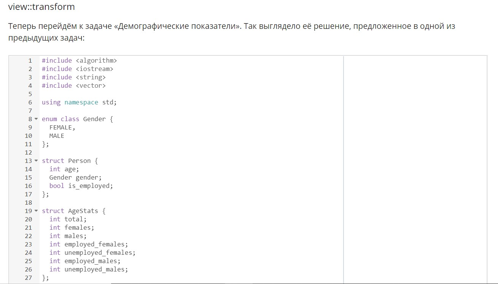
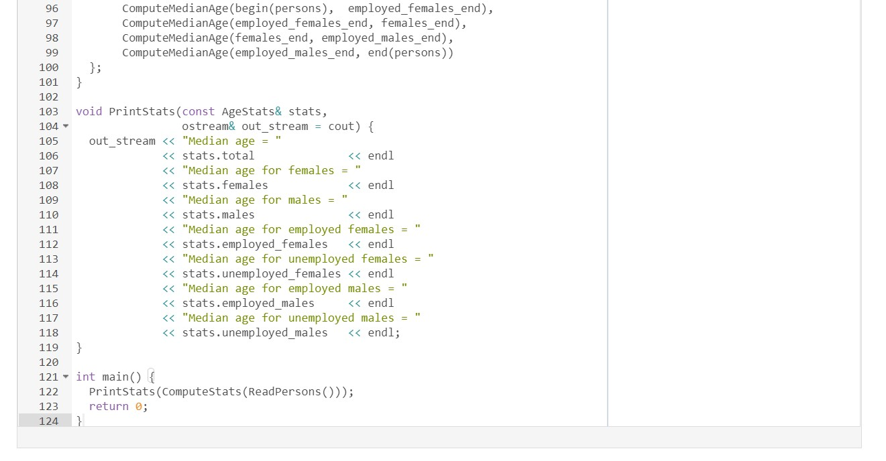
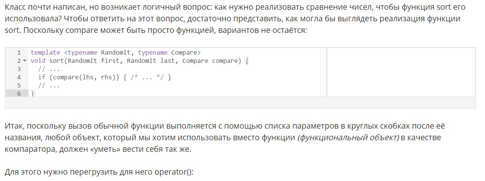
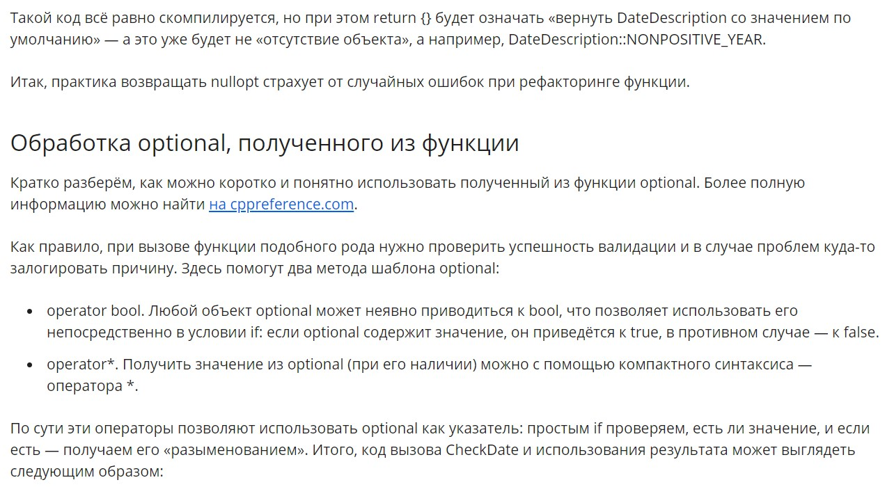
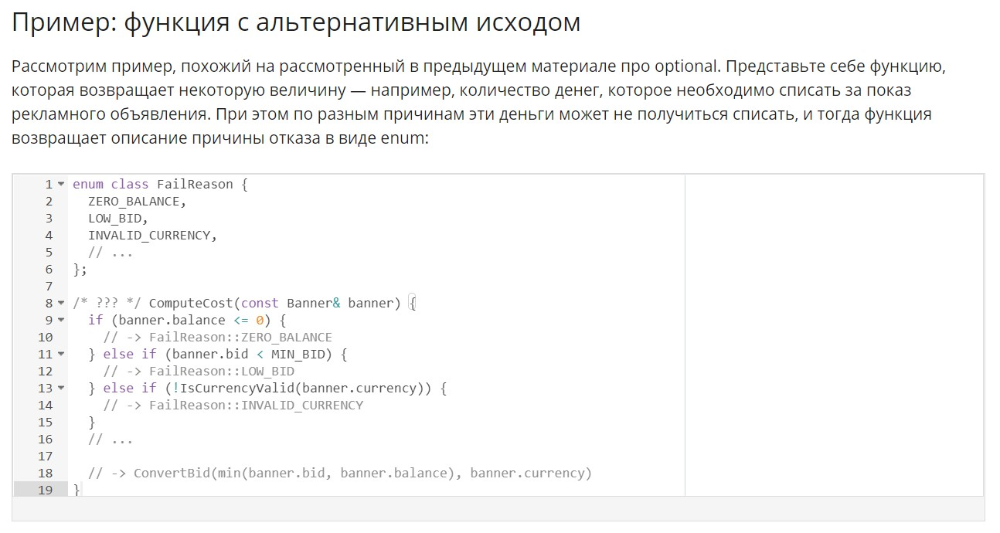
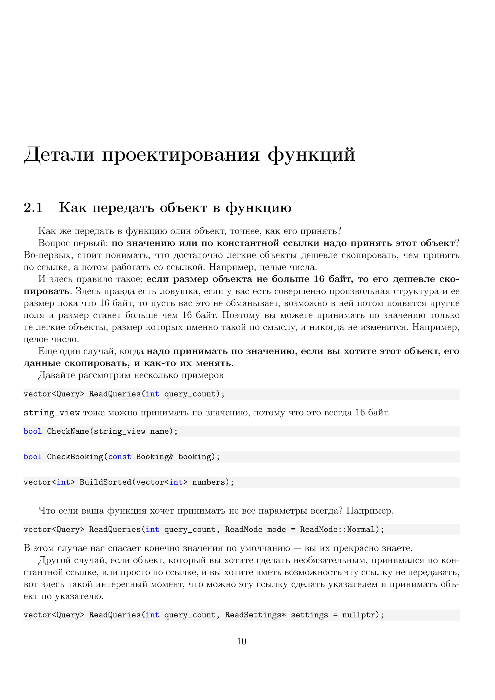

# std::span

# Ranges

# Особые случаи передачи объектов

# std::optional и возврат его из функции

# std::variant и возврат его из функции

# Функции с побочными эффектами

# Неконстантные методы классов

# Как вернуть из функции набор объектов

# Другие способы рефакторинга конструкторов со сложными сигнатурами

# Как рефакторить функции с большим количеством параметров

# Работа с датами

# [Конспет лекций за пятую неделю](./5th-week-summary.pdf)

